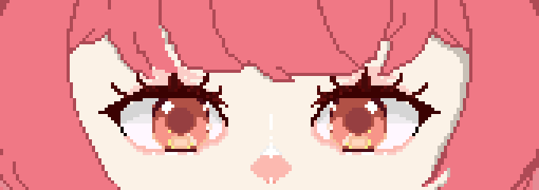
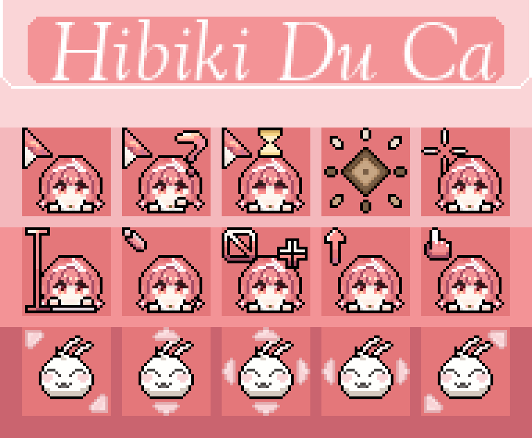
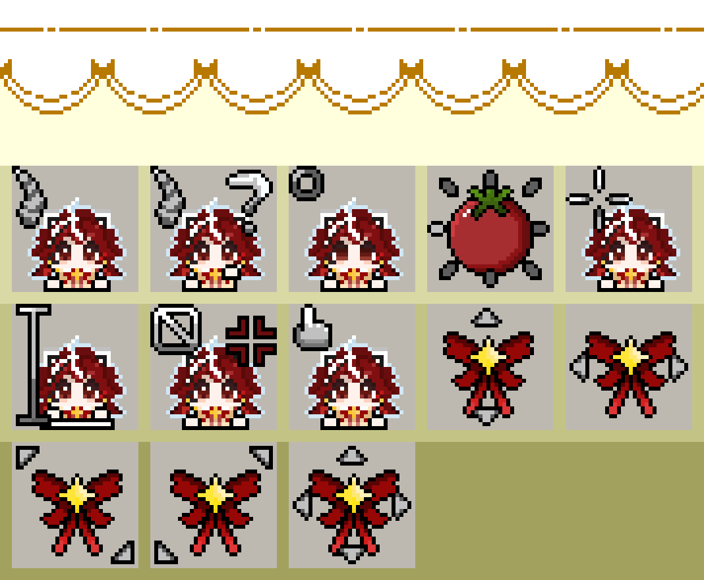
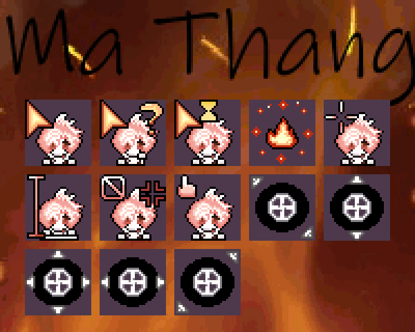

<h1 align="center">Hi 👋, I'm Nguyễn Ngân Lượng</h1>

<h3 align="center">Back-end Developer | Game Development Enthusiast | Pixel Art Lover</h3>

---

## 🌟 About Me

Hello! My name is **Nguyễn Ngân Lượng**. Online, I usually go by **Luno**.

I am a **Back-end Developer** who enjoys building clean, efficient, and scalable applications.  
Besides programming, I am also interested in **Game Development** and **Pixel Art Drawing**.

I love learning new technologies, improving my coding skills, and creating useful digital products.

---

## 🚀 Top Skills

### 💻 Languages / Programming

<p>
  
  
  
  
  
</p>

### 🧩 Frameworks

<p>
  
  
  
  
</p>

### 🗄️ Databases

<p>
  
  
  
  
</p>

### ☁️ DevOps & Cloud Native

<p>
  
</p>

### 🛠️ Tools

<p>
  
  
  
  
  
</p>

### 🎨 Design

<p>
  
</p>

---

## 📚 Currently Learning

<p>
  
  
  
</p>

- Unity basics
- Game Development fundamentals
- Pixel Art animation
- Back-end architecture
  
---

## 🎮 Interests

- Back-end Development
- Game Development
- Pixel Art
- Software Architecture
- Database Design

---

## 🎨 My Pixel Art Showcase

<table align="center">
  <tr>
    <td align="center">
      <br/>
      <b>Random Gif</b>
    </td>
    <td align="center">
      <br/>
      <b>Random Gif</b>
    </td>
    <td align="center">
      <br/>
      <b>Cursors</b>
    </td>
    <td align="center">
      <br/>
      <b>Cursors</b>
    </td>
    <td align="center">
      <br/>
      <b>Cursors</b>
    </td>
  </tr>
</table>

## 📫 Contact Me

<p>
  <a href="mailto:nnl8a1@gmail.com">
    
  </a>

  <a href="https://www.linkedin.com/in/ngan-luong-nguyen-928b283a5/">
    
  </a>
</p>

---

## 📊 GitHub Stats

<p align="center">
  
</p>

<p align="center">
  
</p>

---

## ✨ Quote

> Keep learning, keep building, and keep improving every day.

---

<h3 align="center">Thanks for visiting my profile! 🚀</h3>
```
